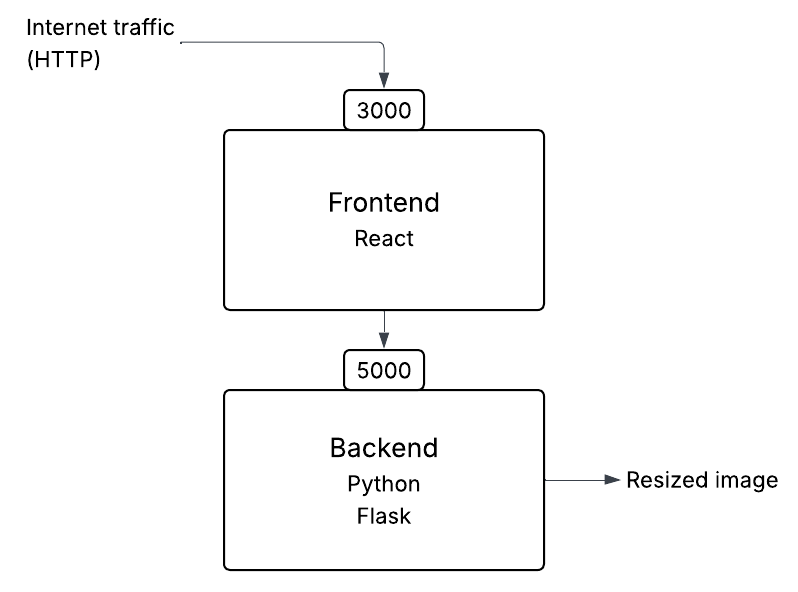
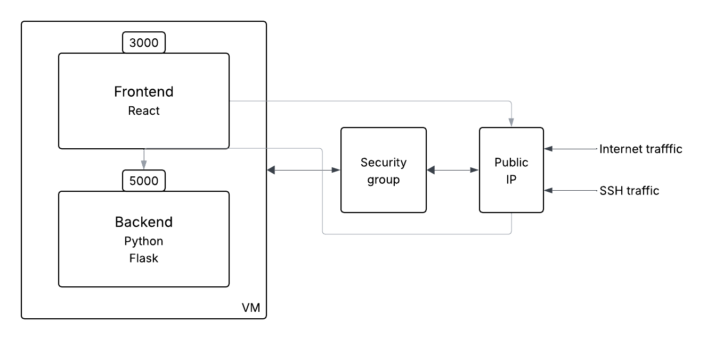

# Image Resizer App

- [Image Resizer App](#image-resizer-app)
  - [Manual deployment on local machine (no database)](#manual-deployment-on-local-machine-no-database)
    - [Backend](#backend)
    - [Frontend](#frontend)
  - [Manual deployment on EC2 Instance (no database)](#manual-deployment-on-ec2-instance-no-database)
  - [Manual deployment on local machine with database](#manual-deployment-on-local-machine-with-database)


## Manual deployment on local machine (no database)

### Backend

**Create Python virtual environment**
- `python -m venv venv` to create a venv
- `source venv/bin/activate` to activate
- `pip install -r requirements` to install dependencies


**To run**
- cd to backend
- `python app.py`
- check at localhost:5000


### Frontend

- cd to frontend
- install node.js https://nodejs.org/en/download
- `npm install` to install dependencies
- `npm start` to launch
- use app at localhost:3000


**Diagram** for reference



## Manual deployment on EC2 Instance (no database)

**Create EC2 instance**
- Ubuntu Server 24.04 LTS, 64-bit (x86)
- Instance type: t3.micro
- Security group:
  - allow SSH
  - allow HTTP from anywhere
  - allow TCP 3000 and 5000 from anywhere
- `sudo apt update` and `sudo apt upgrade` on new instance

**File transfer**
- `rsync -avz -e "ssh -i <private key file path>" <path of file to transfer> <machine to send it to>:<where to save it>`
- e.g. `rsync -avz -e "ssh -i /Users/tabmad/.ssh/tech508-tabitha-aws.pem" /Users/tabmad/Sparta/app_code/image-processing-app-v1.0.zip ubuntu@ec2-108-129-182-224.eu-west-1.compute.amazonaws.com:/home/ubuntu`
  - `-avz` not strictly necessary. a: archive mode, preserves permissions etc. v: verbose to output more information about what's being done. z: compress file data during the transfer
  - `-e` specifying the remote shell to use
  - `ssh -i` runs SSH with the -i flag to use a specific private key file 


**Unzip file**
- `sudo apt install unzip` if not already
- `unzip image-processing-app-v1.0.zip` to unzip

**Backend**
- make sure python-venv is installed
  - `sudo apt install python3.12-venv`
- cd backend
- `python3 -m venv venv` to create a venv
- `source venv/bin/activate` to activate
- `pip install -r requirements.txt` to install dependencies
- check IP of vm
  - `curl http://checkip.amazonaws.com` -> e.g. 34.244.11.103
- `flask run --host=0.0.0.0 --port=5000` to run where it can be accessed outside the vm

**Frontend**
- make sure node is installed
  - `sudo apt install nodejs`
- cd to frontend
- npm install separately
  - `sudo apt install npm`
- `npm install` to install dependencies
- `HOST=0.0.0.0 PORT=3000 npm start` to run

**Access**
- http://(ip as found with curl):5000 for backend
- http://(ip as found with curl):3000 for frontend

**Diagram**
for reference:



## Manual deployment on local machine with database

**Install PostgreSQL**
- download from website and install
  - default port 5432
- add path to .zshrc (or .bash_profile is using bash): `export PATH="/Library/PostgreSQL/17/bin:$PATH"`
- `source ~/.zshrc` to apply changes
- `psql -U postgres` to start

**Create database and user**
- `CREATE DATABASE image_processing;` to create the database
  - `\l` to check it has been created
- `CREATE USER imguser WITH PASSWORD 'test4321';` to create a user and password
  - `\du` to check the user has been created
- then run the following: 
  - `GRANT ALL PRIVILEGES ON DATABASE image_processing TO imguser;` to give imguser full access on the created database
  - `GRANT ALL PRIVILEGES ON SCHEMA public TO imguser;` to give imguser full control over public schema
    - makes user able to create, modify or drop object and use the schema in SQL queries
  - `ALTER DEFAULT PRIVILEGES IN SCHEMA public GRANT ALL ON TABLES TO imguser;` to automatically grant the user all privileges on new tables created in the public schema
  - `ALTER USER imguser WITH SUPERUSER;` to temporarily give imguser SUPERUSER privileges

**Set environment variables**
- exit psql
- `nano ~/.zshrc` and add add the host and imguser's password:
  - `export DB_HOST=localhost`
  - `export DB_PASS=test4321`
- `source ~/.zshrc` to apply changes immediately

**Create database schema**
- cd backend
- `source venv/bin/activate` first to activate venv
- `flask db init` to initialise a migration environment
- `flask db migrate -m "Initial migration"` to generate a database migration script containing the steps needed to bring the database schema in sync with the models
- `flask db upgrade` to apply the database migrations
- to check everything's been created:
  - open psql
  - `\c image_processing` to connect to the right database if not already
  - `\dt` to see the list of relations - should show requests and users tables

**Remove SU priviledges**
- `ALTER USER imguser WITH NOSUPERUSER;`

**Run**
- Same as without database:
  - `python app.py`
  - cd frontend
  - `npm start` to launch
- then either:
  - go to http://localhost:3000/configure and check 'Enable database features'
- or:
  - set the environment variable `REACT_APP_ENABLE_DB=1` before running

**Error!**

`AttributeError: module 'datetime' has no attribute 'UTC'`
- datetime.UTC was added in Python 3.11
- but for the venv, 
  - `python --version`
  - -> `Python 3.9.13`
- in previous Python versions, timezone.utc served the same purpose
- quick fix, add this code to app.py:
  - ```
    from datetime import timezone
    # patch: add timezone UTC if missing from datetime
    if not hasattr(datetime, "UTC"):
        datetime.UTC = timezone.utc
    ```

