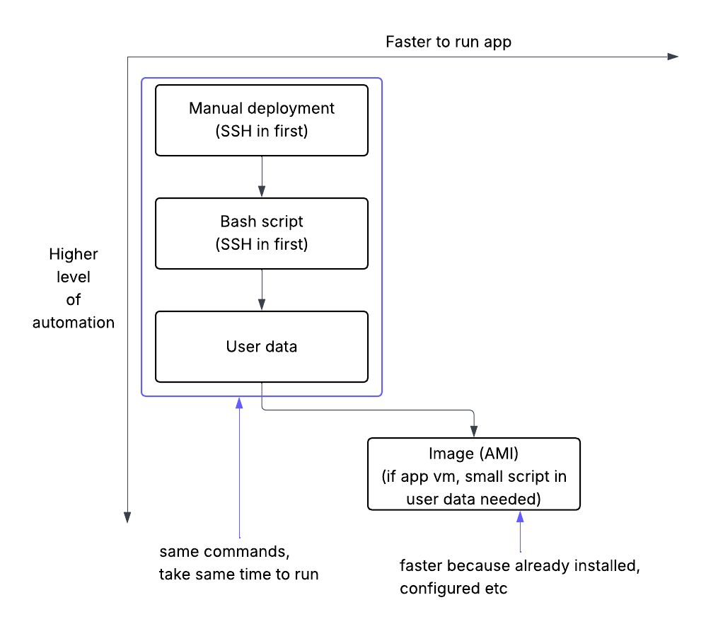

# Sparta App

- [Sparta App](#sparta-app)
  - [Git initialisation](#git-initialisation)
  - [EC2 Instance](#ec2-instance)
  - [Script for app](#script-for-app)
  - [EC2 Instance for database](#ec2-instance-for-database)
  - [Script for database](#script-for-database)
  - [Connect app and database](#connect-app-and-database)
  - [Make script run without input](#make-script-run-without-input)
  - [Run in background](#run-in-background)
    - [To stop](#to-stop)
    - [Or using pm2](#or-using-pm2)
  - [Configure Nginx](#configure-nginx)
  - [Run script from User Data](#run-script-from-user-data)
  - [Levels of automation for app deployment using VMs](#levels-of-automation-for-app-deployment-using-vms)
  - [Creating VMs from AMIs](#creating-vms-from-amis)

## Git initialisation
- in correct folder
- `git init`
- `git add .`
- `git commit -m "first commit"`
- create new repo on github
- `git remote add origin https://github.com/tjmad43/tech508-sparta-app.git`
  - note: to remove incorrect origin, `git remote remove origin`
- `git push -u origin main`

## EC2 Instance
- Ubuntu Server 22.04
- t3.micro
- Security group:
  - allow SSH
  - allow HTTP
  - allow TCP Port 3000 from anywhere

## Script for app
see provision.sh

- Updates & installs
  - `sudo apt update`
  - `sudo apt upgrade -y`
  - `sudo apt-get install nginx -y`
- Install node.js v20 (installs npm commands too)
  - `sudo DEBIAN_FRONTEND=noninteractive bash -c "curl -fsSL https://deb.nodesource.com/setup_20.x | bash -" && \
sudo DEBIAN_FRONTEND=noninteractive apt-get install -y nodejs`
  - check version: `node -v`
- download app code to a 'repo' folder
  - `git clone https://github.com/tjmad43/tech508-sparta-app repo`
- cd into repo
  - `cd repo/app`
- install packages for app
  - `npm install`
- start app
  - `npm start`

## EC2 Instance for database
- Ubuntu Server 22.04
- t3.micro
- Security group:
  - allow SSH
  - allow port 27017 from anywhere

## Script for database
see provisiondb.sh

- updates
  - `sudp apt-get update`
  - `sudo apt upgrade -y`
- import public key
  - `sudo apt-get install gnupg curl`
  - `curl -fsSL https://www.mongodb.org/static/pgp/server-7.0.asc | \
   sudo gpg -o /usr/share/keyrings/mongodb-server-7.0.gpg \
   --dearmor`
- create list file
  - `echo "deb [ arch=amd64,arm64 signed-by=/usr/share/keyrings/mongodb-server-7.0.gpg ] https://repo.mongodb.org/apt/ubuntu jammy/mongodb-org/7.0 multiverse" | sudo tee /etc/apt/sources.list.d/mongodb-org-7.0.list`
- reload package database
  - `sudo apt-get update`
- install mongo db
  - `sudo apt-get install -y \
   mongodb-org=7.0.22 \
   mongodb-org-database=7.0.22 \
   mongodb-org-server=7.0.22 \
   mongodb-mongosh \
   mongodb-org-shell=7.0.22 \
   mongodb-org-mongos=7.0.22 \
   mongodb-org-tools=7.0.22 \
   mongodb-org-database-tools-extra=7.0.22`
  - MongoDB Community Edition from Database Manual version 7 instructions for Ubuntu 22.04: https://www.mongodb.com/docs/v7.0/tutorial/install-mongodb-on-ubuntu/

these steps need to be changed to require no user input:
- `cd /etc`
- create a backup of config file
  - `sudo cp mongod.conf mongod.conf.bk`
- `sudo nano mongod.conf`
- change bindIp: 127.0.0.1 to 0.0.0.0 in file

start and enable database
- `sudo systemctl start mongod`
- `sudo systemctl status mongod`
- `sudo systemctl enable mongod`

## Connect app and database
- in app script/terminal, before npm start:
  - set environment variable
    - `export DB_HOST=mongodb://<database private IP>:27017/posts`
  - manually seed db
    - `node seeds/seed.js`

## Make script run without input
- add variable to make `sudo apt` commands non-interactive
  - `DEBIAN_FRONTEND=noninteractive`
- use `sed` to change the bindIP:
  - `sed -i 's/old_text/new_text/' filename`
  - where `-i` is the in-place editing flag
  - `s/` means substitute
- importing the public key for the database asks the user if the file should be overwritten if already existent. Avoid prompt by writing to a temp file, then force-moving it:
  - `curl -fsSL https://www.mongodb.org/static/pgp/server-7.0.asc | \
gpg --dearmor | \
sudo tee /usr/share/keyrings/mongodb-server-7.0.gpg > /dev/null`
  - `tee` overwrites the file without asking. Redirecting `> /dev/null` suppresses output
- **OR** just add `--yes` to the original command

- to run scripts:
  - put into git repo & pull, or create new script file and paste
  - `chmod +x <script>.sh` to add execute permissions
  - `./<script>` to run

## Run in background
- `nohup npm start &`

### To stop
- find process ID (node)
  - use `jobs` or `ps -e`
  - use `lsof -i :3000` to directly find what's using port 3000
- use PID to kill
- make sure it is able to be re-run

### Or using pm2
- install
  - `sudo npm install -g pm2`
- start script from terminal
  - `pm2 start <script name>.sh --interpreter bash`
  - add a name to make it easier to find: `pm2 start <script>.sh --name <name> --interpreter bash`
- or from within script, change `nohup npm start &` to
  - `pm2 start app.js`
- view running processes
  - `pm2 list`
- stop
  - `pm2 stop all`
  - if only `pm2 stop <name>` the node child process will continue 
  - `pm2 delete all` 

 
 ## Configure Nginx
- currently the app is accessed by going to http://[public IP]:3000
- **reverse proxy:** in order for the public IP to lead to the app instead of typing in port 3000, configure nginx to automatically reroute to port 3000
- the file that needs to be altered is `/etc/nginx/sites-available/default`
- replace the line `try_files $uri $uri/ =404;` with `proxy_pass http://localhost:3000;`, again with `sed`
  - `sudo sed -i 's|try_files \$uri \$uri/ =404;|proxy_pass http://localhost:3000;|' /etc/nginx/sites-available/default`
 - then reload nginx: `sudo systemctl reload nginx`

## Run script from User Data
- instead of creating or moving script file to vm, insert into "user data" box when creating vm
- notes:
  - script will only run once, after vm is created
  - files created will be saved under root directory not ubuntu user, make sure file paths go to correct place
    - keeping relative path `git clone ... repo` `cd repo/app` will still work (just from root directory)
  - must start with the she-bang line still
  - make sure to use script with _no user input_
  - app may not show up straight away - script takes some time to run through
- when starting up:
  - check database script worked before creating vm for app
    - ssh in
    - `sudo systemctl status mongod` for database status
    - `cat /etc/mongod.conf | grep bindIp` to check the bindIp was changed correctly
  - app script will take a while to run - while that's happening, ssh in and use `htop` to monitor it
    - `sudo nano /var/log/cloud-init-output.log` to create a log file for troubleshooting 

## Levels of automation for app deployment using VMs

An AMI (Amazon Machine Image) is a preconfigured virtual machine image to launch new instances from. They include:
- OS
- software installed
- any other data

of the VM the image was taken from.

The app script has already been run through user data in the original VM and will not be run again -> everything has been installed and configured but the app itself will not be told to start up. 

A small script should be given in user data of the new VM being made from the image including:
- #!/bin/bash
- cd into app folder
- set environment variable for database private IP
- pm2 start app.js

## Creating VMs from AMIs
- create database and app VMs with previous scripts in user data, make sure the app works exactly as it should
- on each VM:
  - _Actions_ -> _Create image_
  - naming convention: tech508-tabitha-test-sparta-app-ready-to-run-database/app
  - _Add new tag_
    - "Name" - name as above
  - _Create image_
- when status is _Available_, _Launch instance from AMI_
- database as usual
- app needs short script in user data:
  - see run-app-only.sh
  - `#!/bin/bash` to define bash script
  - `export DB_HOST=mongodb://<privIP>:27017/posts` set env var for database IP
    - make sure to change to the new db instance IP
  - `cd repo/app` navigate to app folder
  - `pm2 stop all` stop any previous processes
  - `pm2 start app.js` start the app
