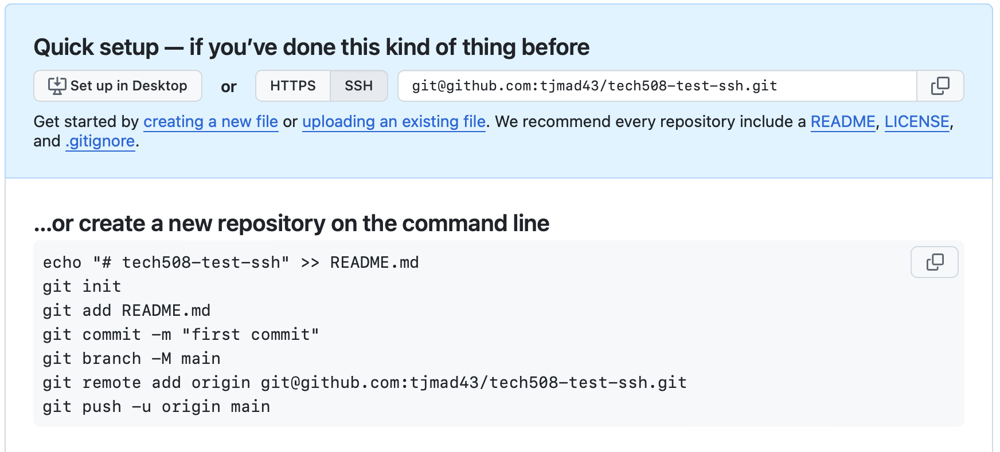

# SSH

1. Create SSH key
   - SSH key pair (type: RSA)
     - asymmetric - private key and public key.
     - private key can generate public key.
2. Register the public key
3. Add private key to SHH register (locally)
4. Create a test repo on git
5. Push changes to repo using SSH

### In action:

1. - cd ~
   - cd .ssh or mkdir .ssh
   - ssh-keygen -t rsa -b 4096 -C "tabbymadhavan@gmail.com"
   - filename is tabitha-github-key
   - file with no .pub extension (or sometimes with .pem) is PRIVATE key, do not share
2. - github -> settings -> SSH and GPG keys
   - make title same as file: tabitha-github-key
   - cat tabitha-github-key.pub in terminal
   - paste into key textbox - NO EXTRA SPACES OR CHARACTERS
   - click add key
3. - eval `ssh-agent -s`
   - for above ^ backticks included
   - ssh-add tabitha-github-key
4. - ssh -T git@github.com
5. - create new repo on github website
   - cd to location for repo
   - follow instructions for new repo but with SSH:
   - 
   - mkdir tech508-test-ssh
   - cd tech508-test-ssh
   - git init
   - git add .
   - git commit -m "note"
   - git remote add origin git@github.com:tjmad43/tech508-test-ssh.git
   - git push -u origin main