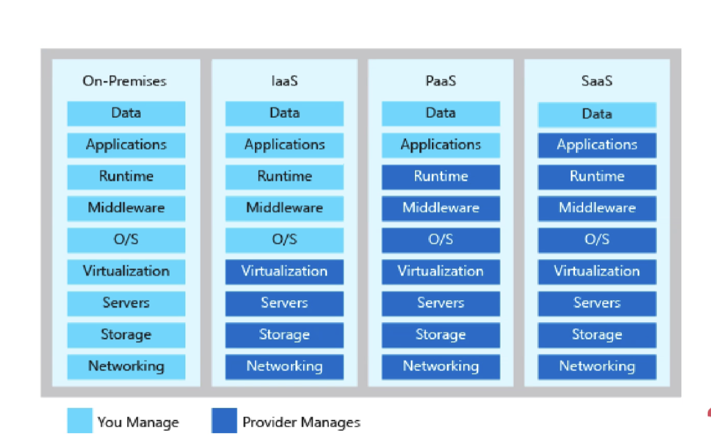
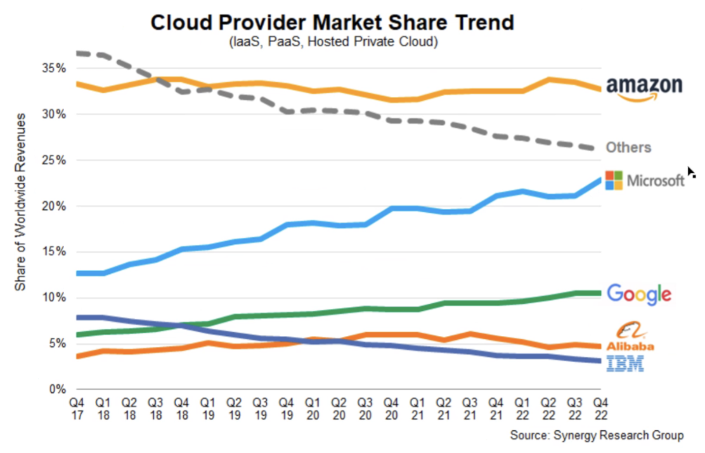

# Intro to Cloud

## What is cloud computing?
- on-demand delivery of computing of power, storage, and other services 
- that is centrally managed and delivered as a service

## How do we know if something is in the cloud? 

### If it's yes to all of these questions:
- delivered as a service over the internet?
- available on demand?
- centrally managed?

## The 4 deployment models of clouds:

- public
  - multi-tenant cloud - muliple occupants
  - shared with the public
  - owned and operated by a cloud service provider (e.g. aws)
- private
  - single-tenant cloud
  - may run over a private network (not the internet)
  - e.g. on a cruise ship
- hybrid
  - mix of one of above systems (usually pubic) and on-prem 
- multi-cloud
  - mix of multiple cloud providers used
  - e.g. certain things running on aws

## Types of cloud services - What are the differences?

- on-prem - control over everything
- IaaS (Infrastructure as a Service) - networking -> virtualisation managed by provider. e.g. virtual machine
- PaaS (Platform as a Sevice) - e.g. an app service. Only data and apllications managed by owner
- SaaS (Software as a Service) - only data managed by you. e.g. things like microsoft office

## Advantages and disadvantages of cloud

### Ad
- Economy of scale
- Pay for what you use (less upfront cost)
  - OpEx vs CapEx
- Physical security
- Redundancy/hight availability/uptime
- May get compensation if they meet the SLA (Service Level Agreements)

### Dis
- Not in control of things physically
- Many uknowns - e.g. you don't know where exactly your workloads are running
- Complexity + different expertise required (especially for hybrid/multi-clouds)

### To be proven:
- Is it cheaper for your use case? -> Need TCO (Total Cost of Ownership calculator)

## Marketshare

- AWS is longest established, has largest collection of data centress across the world, most documentation
- All have similar services to meet needs of customers - skills are transferrable

## What sorts of things do you usually need to pay for when using the cloud?

- staff
- storage (quantity, type of access)
- computing power
- traffic (usually going OUT - egress)
- public IP addresses 
- serverless - usually pay the more traffic you get
