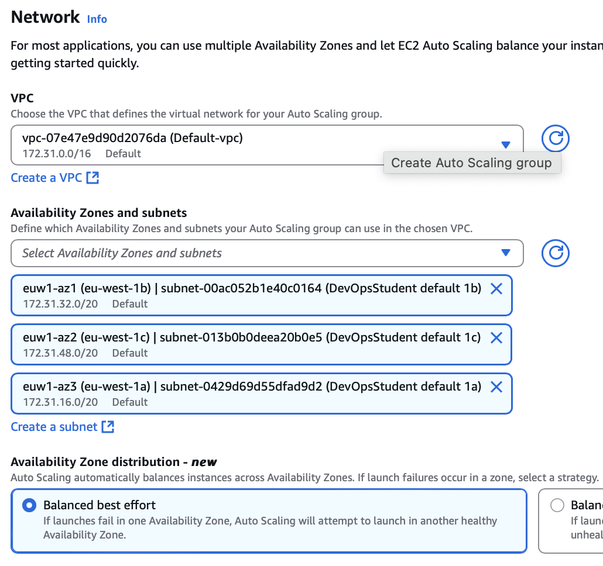

# Auto Scaling Groups

## Why use an AWS Auto Scaling Group?

## Diagram

## Create Launch Template

- _Create launch template_
- naming convention: tech508-tabitha-for-asg-app-lt
- Application and OS Images (Amazon Machine Image) 
  - _My AMIs_ -> _Owned by me_
  - select image
- Instance type: t3.micro
- Security group: select one from before, but port 3000 isn't necessary now
- User data
  - only need to find app folder and start it:

        #!/bin/bash
        echo "Find app folder..."
        cd repo/app
        echo "Done"
        echo

        echo "Start app..."
        pm2 start app.js

- _Create launch template_

- in template:
  - _Actions_ -> _Launch instance from template_
  - everything should already be filled in
  - Resource tags: Name, name as before
  - _Launch instance_

## Create ASG

- _Auto Scaling Groups_ -> _Create Auto Scaling group_

**Step 1:**
- name: tech508-tabitha-app-asg
- add launch template from above

**Step 2:**
- default vpc
- Availability Zones and subnets: DevOpsStudent default 1a,b,c
  
- Availability Zone distribution: Balanced best effort

**Step 3:**
- Attach to a new load balancer
  - Application Load Balancer
  - name: tech508-tabitha-app-asg-lb
  - Internet-facing
  - Listeners and routing:
    - default routing - Create a target group
    - name: tech508-tabitha-app-asg-lb-tg
      
- Health checks: Turn on Elastic Load Balancing helath checks
- Health check grace period: can leave at 300secs but can go less for this - 180

**Step 4:**
- Desired capacity: 2
- Scaling:
  - Min 2
  - Max 3
  - Target tracking scaling policy:
    - Avergae cpu utilisation
    - Target value 50
    - Instance warmup 180
- Instance maintenance policy: No policy
- Additional capacity settings: default

**Step 5:**
- Add notifications: not needed

**Step 6:**
- Add tag: Name, tech508-tabitha-app-asg-HA-SC

Review and _Create auto scaling group_

**To access**
- find load balancer
- DNS name as URL

## Cleaning up 
- go to Auto Scaling groups
  - select correct one
  - _Actions_ -> _Delete_
- go to load balancer
  - _Actions_ -> _Delete_
- go to Target Groups
  - _Actions_ -> _Delete_

