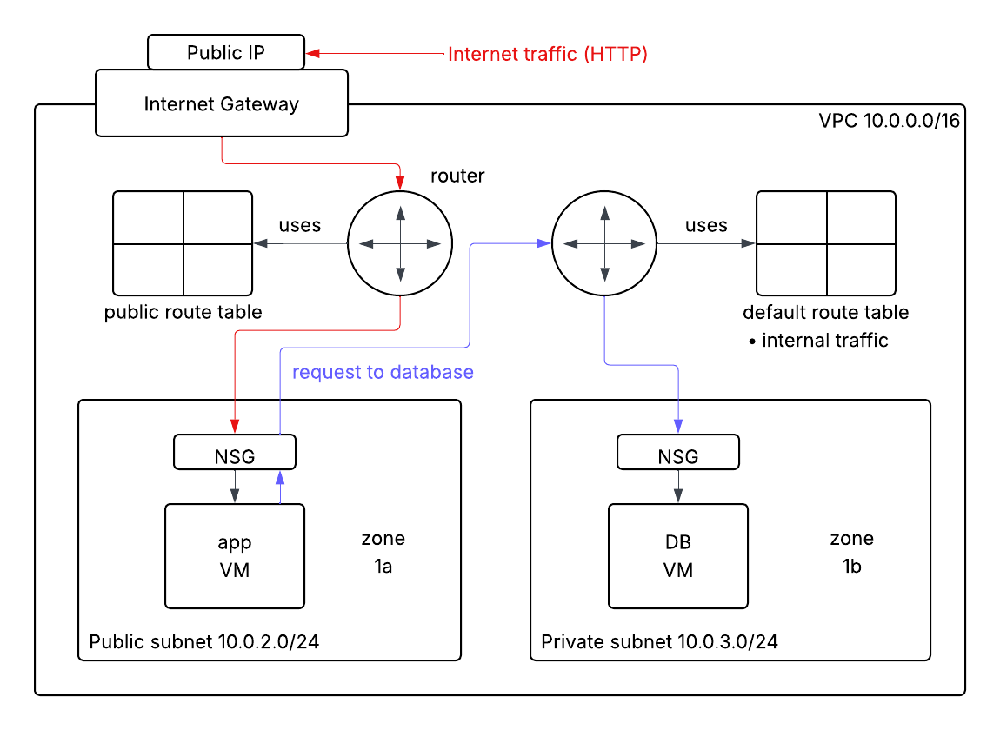
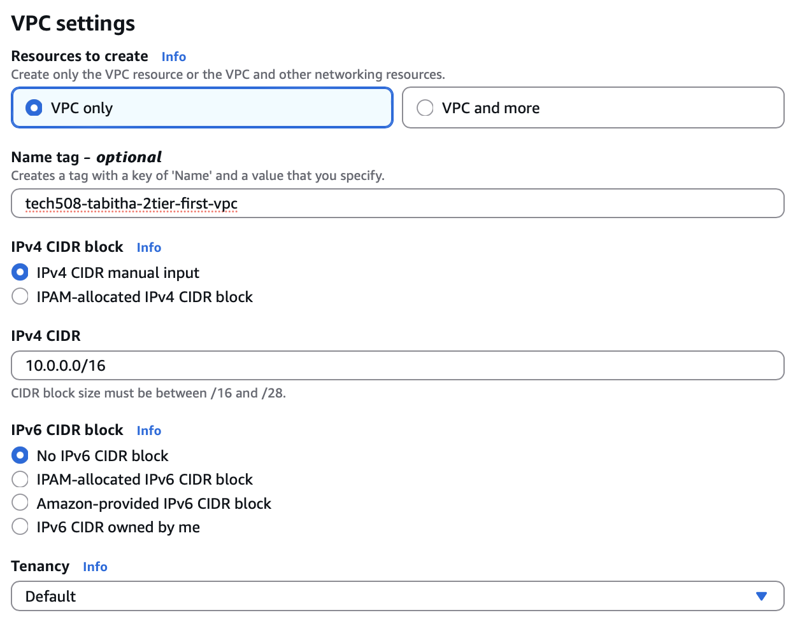
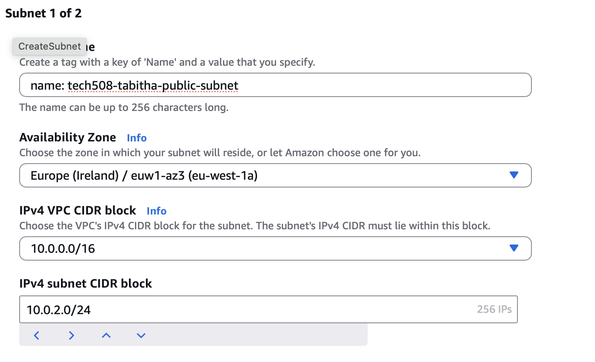

# VPCs

**VPC**: Virtual Private Cloud

The problem so far: database not secure
- bindIp set to 0.0.0.0
- port 27017 open with no authentication

## Architecture diagram

- database has no route to internet traffic
  - have to SSH in through app VM
  - everything _has_ to be installed already as no access to internet

**Note:** CIDR blocks

`10.0.0.0/16`

- first 4 numbers: each have 8 bits, range 0-255
- `/16` means the first 16 bits are locked
  - e.g. `10.0` 
  - so the last `0.0` can be used/changed to give possible IP addresses

## Create custom VPC
 - _VPCs_
 - _Create VPC_ (make sure Ireland region)
   - VPC only
   - name: tech508-tabitha-2tier-first-vpc
   - IPv4 CIDR: 10.0.0.0/16
   - name tag already filled in
   - _Create VPC_
    

## Create subnets
- _Subnets_ (left dashboard under Virtual private cloud)
- _Create subnet_
  - select VPC from above
  - name: tech508-tabitha-public-subnet
  - Availability Zone: 1a
  - IPv4 subnet CIDR block: 10.0.2.0/24
    
- _Add new subnet_
  - name: tech508-tabitha-private-subnet
  - Availability Zone: 1b
  - IPv4 subnet CIDR block: 10.0.3.0/24
- _Create subnet_

## Create internet gateway
- _Internet gateways_
- _Create internet gateway_
  - name: tech508-tabitha-2tier-first-vpc-ig
  - _Create internet gateway_
- _Attach to a VPC_ (or _Actions_ -> _Attach to VPC_)
  - select VPC
  - _Attach internet gateway_

## Create route tables
- _Route tables_
- _Create route table_
  - name: tech508-tabitha-2tier-first-vpc-public-rt
  - select VPC
  - _Create route table_
- _Actions_ -> _Edit subnet associations_
  - check public subnet
  - _Save associations_
- _Edit routes_
- _Add route_
  - Destination: 0.0.0.0/0
  - Target: Internet Gateway
  - igw-: select internet gateway ID from dropdown
  - _Save changes_

## Create VMs
- Launch instance from database AMI
  - name: tech508-tabitha-in-2tier-vpc-sparta-app-db
  - instance type, key pair same as usual
  - Network settings:
    - _Edit_
    - select VPC
    - select private subnet
    - Auto-assign public IP: Disable
    - Create security group:
      - name: tech508-tabitha-2tier-vpc-sparta-app-db-sg-allow-27017
      - remove SSH
      - Add security group rule: custom tcp, 27017, anywhere (or can add CIDR block)
  - _Launch instance_

- Launch instance from app AMI
  - name: tech508-tabitha-in-2tier-vpc-sparta-app
  - Network settings:
    - select VPC
    - select public subnet
    - Auto-assign public IP: Enable
    - Create security group:
      - name: tech508-tabitha-2tier-vpc-sparta-app-allow-SSH-HTTP
      - SSH Source type: My IP
      - Add security group rule: HTTP - from anywhere
  - User data (make sure to use IP of database instance just created):
       
        #!/bin/bash
        cd repo/app
        export DB_HOST=mongodb://10.0.3.96:27017/posts
        pm2 start app.js
        
  - _Launch instance_

## Clean up
- Terminate instances
- Delete VPC
  - route table, security groups and subnets will be deleted along with it