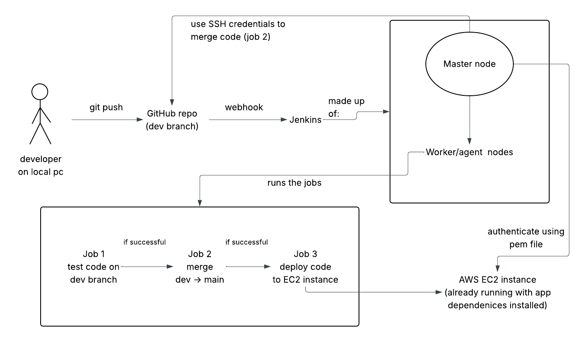
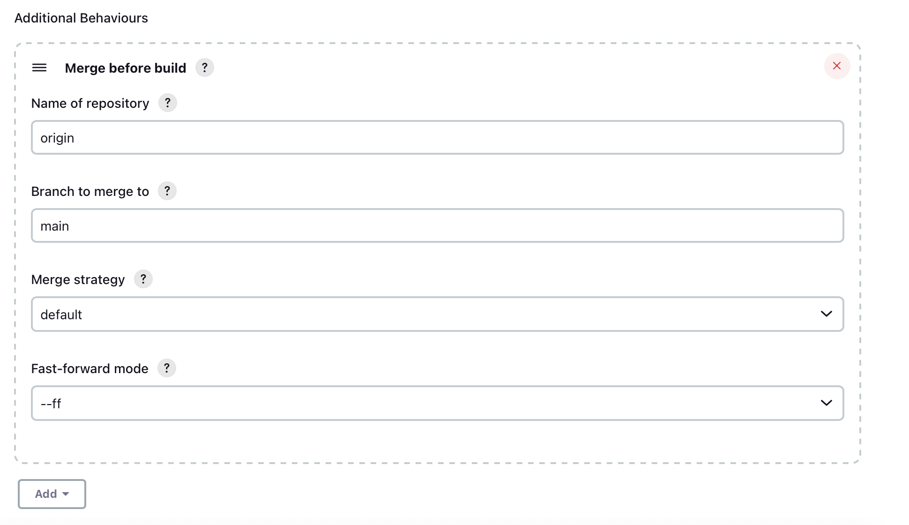
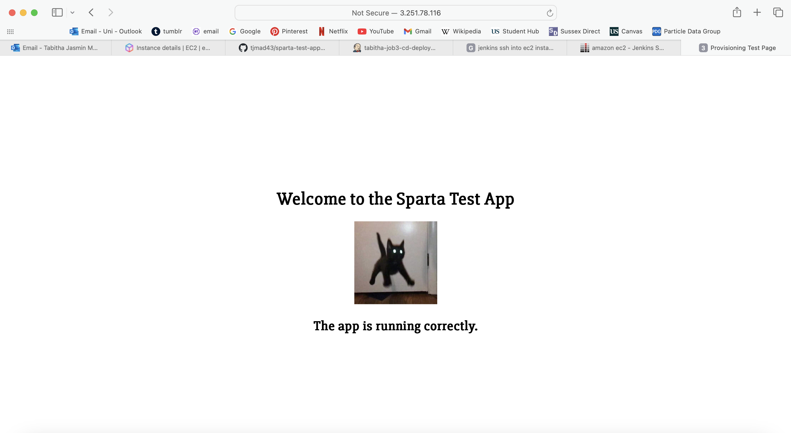

# Sparta App

## Architecture


## Setup
- github repo for app
- new SSH key:
  - `cd .ssh`
  - `ssh-keygen -t rsa -b 4096 -C "tabbymadhavan@gmail.com"`
  - name: tabitha-jenkins-to-github-key
  - no passphrase
- change github settings:
  - _Settings_ (for repo)
  - _Security_ -> _Deploy keys_
  - _Add deploy key_
    - same name as above
    - in terminal: `cat tabitha-jenkins-to-github-key.pub` 
    - copy paste in Key section
    - Allow write access
  
## First job
needs to:
- run when changes are pushed to git repo
- test them

### Job setup
- tabitha-job1-ci-test
- freestyle project
  - Description: job 1 - tests code on dev branch
  - Discard old builds - Max 5
  - GitHub project
    - HTTPS link - remove .git from end, add /
  - Source Code Management
    - Git
      - SSH link in Repository URL
      - Credentials: _Add_
        - _Jenkins_
        - Domain: leave default
        - Kind: SSH
        - Scope: Global
        - ID: tabitha-jenkins-to-github-key
        - Description: to readwrite to repo
        - Username: tabitha-jenkins-to-github-key
        - Private key -> add 
          - in terminal: `cat tabitha-jenkins-to-github-key`
          - paste into Jenkins (include header and footer)
        - No passphrase
        - _Add_
      - Select key
    - Branch Specifier: */main
  - Build Environment
    - Provide Node & npm bin/ folder to PATH
      - NodeJS version 20
  - Build Steps
    - _Add build step_ - _Execute shell_
      - `cd app`
      - `npm install`
      - `npm test`
  - _Save_


### Webhook
On github:
- _Settings_ -> _Webhooks_
  - _Add webhook_
    - Payload URL: http://52.31.15.176:8080/github-webhook/ (from Jenkins URL with github-webhook/ on the end)
    - everything else default

On Jenkins:
- _Configure_ tabitha-job1-ci-test
  - _Build triggers_
    - GitHub hook trigger for GITScm polling

Test:
- cd to repo
- change something
- push change
- should Build automatically


### Dev branch
- `git branch dev`
- `git switch dev`

On Jenkins:
- _Configure_
- Branch Specifier: */dev

## Second job
needs to:
- merge code from dev to main branch if testing in job 1 was successful 

### Job setup
- tabitha-job2-ci-merge
- freestyle project
  - Description: job 2 - merges dev to main branch
  - Discard old builds - Max 5
  - GitHub project
    - HTTPS link: https://github.com/tjmad43/sparta-test-app-cicd/
  - Source Code Management:
    - Git
      - SSH link
      - select SSH key
      - Branch Specifier: */dev
      - _Additional behaviours_:
        - _Merge before build_
          - Name of repository: origin
          - Branch to merge to: main
        
    - Post-build Actions
      - _Git Publisher_
        - Push Only If Build Succeeds
        - Merge Results
  
**Note:** Post-build action with Git Publisher preferred over section in Source code management - and only one is necessary

### Run automatically 
- back in job1:
  - _Add post-build action_
    - _Build other projects_
      - tabitha-job2-ci-merge
      - Trigger only if build is stable

### Test
- in terminal:
  - `git push --set-upstream origin dev` to set up the dev branch (first time)
  - make some change to repo
  - commit & push to dev
  - -> job 1 and 2 should run consecutively


## Job 3
needs to:
  - copy the updated & tested code from Jenkins to EC2 instance
  - Jenkins will need to SSH into the EC2 instance to update the code & re-run the app
  - need to add key/SSH credentials/pem file on Jenkins to access instance
  - use rsync or scp to cope code, not git clone

### EC2 instance
**note:** needs to have all dependencies installed but not clone in the git repo and run it like previous script. could either:
- use previous image without passing user data to start app or
- create new image without git clone and pm2 start steps
  - but can't install dependencies without having the app folder first

**New instance from image**

**Note:** can copy project 2 as a base instead
- from image tech508-tabitha-test-sparta-app-ready-to-run-app (ami-09635785b2158806f)
- name: tech508-tabitha-sparta-app-for-jenkins
- Instance type: t3.micro
- select key pair
- Security group:
  - name: tech508-tabitha-sparta-app-allow-ssh-jenkins-http-3000
  - allow SSH from 52.31.15.176/32 (Jenkins IP)
  - allow HTTP
  - TCP 3000 not necessary (nginx reroute) but putting it in just in case
- no user data - don't want the app folder thats in there to run

### Job setup
give SSH key, use Execute shell section to give replace app folder and run app
- name: tabitha-job3-cd-deploy
- freestyle project
  - Description: job 3 - deploy app to ec2 instance
  - Discard old builds - Max 5
  - GitHub project
    - HTTPS link: https://github.com/tjmad43/sparta-test-app-cicd/
  - Build Environment
    - SSH Agent
      - _Add_ -> _Jenkins_
      - Global credentials
      - Kind: SSH Username with private key
      - Scope: Global
      - ID: tabitha-aws-key
      - Description: to access EC2 instance
      - Username: ubuntu
      - Private key:
        - `cat tech508-tabitha-aws.pem`, copy paste
  - Build Steps
    - _Execute shell_
    - connect through ssh, making sure no user prompts
      - `ssh -o StrictHostKeyChecking=no ubuntu@ec2-3-251-78-116.eu-west-1.compute.amazonaws.com "echo connected"`
    - copy code to a new repo folder (that ubuntu user has permissions over): 
      - `rsync -avz --delete "$WORKSPACE/" ubuntu@ec2-3-251-78-116.eu-west-1.compute.amazonaws.com:/home/ubuntu/repo`
    - ssh in and run the app
      - ```
        ssh ubuntu@ec2-3-251-78-116.eu-west-1.compute.amazonaws.com << 'EOF'
            cd repo/app
            npm install
            pm2 stop all
            pm2 start app.js
        EOF
        ```

### Run automatically
- in job 2:
  - _Add post build action_
    - _Build other projects_
      - tabitha-job3-cd-deploy
      - Trigger only if build is stable


### Test
- making change to app front page so it's clear
  - `cd app/views`
  - `nano index.ejs`
  - changing image to a new one (put in same directory):
    - ``
- push changes
- pipeline should run through
- app running at EC2 public IP
  
