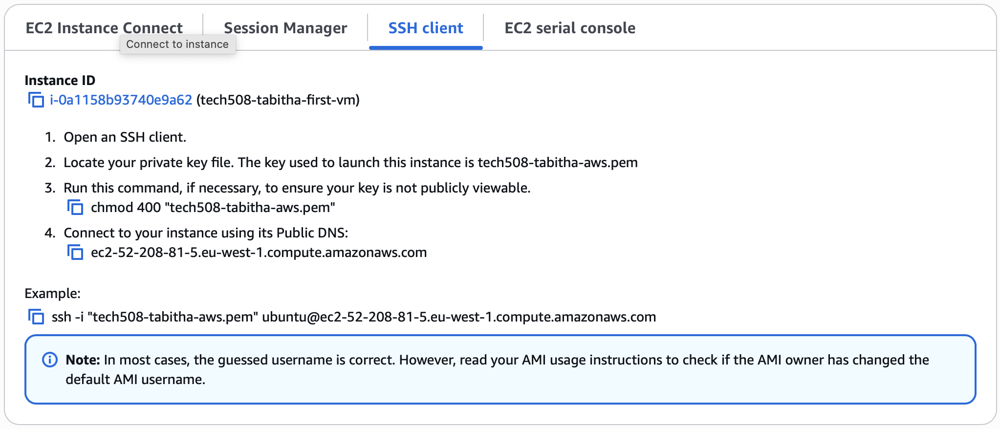

# AWS Virtual Machines

### Important notes
- only use vm in business hours (9-5), ask (before 5pm) if otherwise
- switch off vms when not using and before close of business

## Creating an instance
- naming comvention: tech508-tabitha-description
- Application and OS Images: Ubuntu Server 24.04 LTS
- Instance type: t3.micro
- Use key pair as created previously (make sure it's right one)
- Firewall: create security group
  - Allow traffic from My IP
  - Allow HTTP traffic
  - Click edit, change name to tech508-tabitha-descriptive-name
- Leave storage and advanced details as is
- Click Launch instance

## Launching
Follow instructions for SSH client as given:

- navigate to .ssh folder first
  - or from anywhere, add path before ssh key filename. e.g. `"~/.ssh/tech508-tabitha-aws.pem"`
- `chmod 400 "tech508-tabitha-aws.pem"` to make sure key is not publicly viewable
- `ssh -i "tech508-tabitha-aws.pem" ubuntu@ec2-52-208-81-5.eu-west-1.compute.amazonaws.com` to connect to vm through SSH

## Closing
Before leaving:
- Quit terminal first
- Instances or Instance summary page
- Make sure correct instance is selected
- Instance state dropdown menu -> stop instance