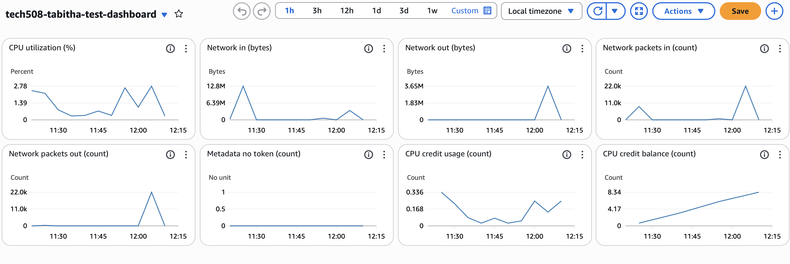
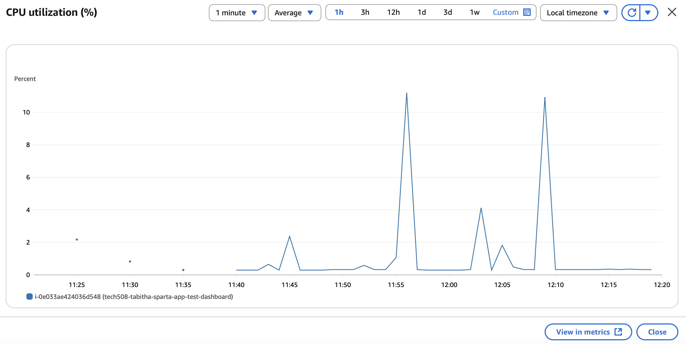
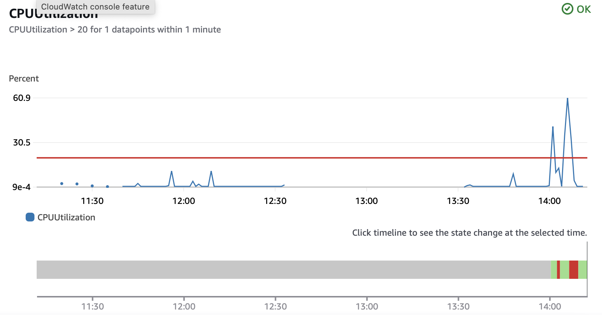
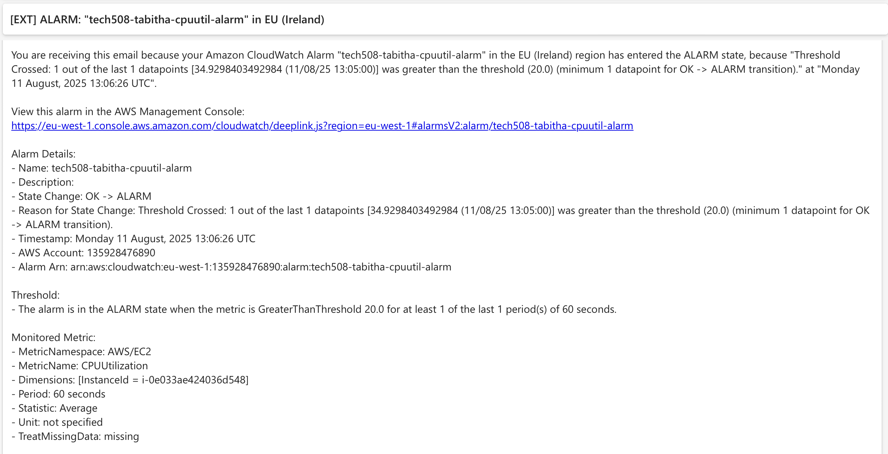

# CloudWatch Dashboards and Alarms

### Create dashboard
- set up VM for app from image (remember user data)
- ssh in - replace `root` with `ubuntu` user

- _Instance summary_ 
  - _Monitoring_
    - _Manage detailed monitoring_
      - _Enable_ - for graphs with a 1-minute period
    - (triple dots) _Add to dashboard_
      - _Create new_
      - name: tech508-tabitha-test-dashboard
      - _Create_
      - _Add to dashboard_

- Dashboard overview
  
- CPU utilisation
  
  - spikes are from refreshing page repeatedly, installing updates and using Apache Bench as documented below

## On dashboard
### Spike CPU for testing alarms
- fibonacci function from the app:
  - `/fibonacci/<numberto go up to>`
- Apache Bench:
  - `sudo apt-get install apache2-utils`
  - `ab -n <number> -c <number> http://<public IP>/`
    - `-n` number of requests to perform
    - `-c` number of multiple requests to make at a time
    - e.g. `ab -n 1000 -c 100 http://54.155.11.47/`
    - or more intensive: `ab -n 10000 -c 200 http://<app VM's IP address>/`

### Creating alarm
see https://docs.aws.amazon.com/AmazonCloudWatch/latest/monitoring/US_AlarmAtThresholdEC2.html
- open CloudWatch console, go to Alarms section
- _Create alarm_
  - _Select metric_
    - Metrics -> select correct region -> EC2
    - _Per instance metrics_
    - search for the correct Instance ID, and find the row with CPUUtilization in the Metric Name column and check the box
    - _Select metric_
  - Statistic: Average (?)
  - Period: 1 minute
  - Conditions:
    - Static, Greater
    - pick a number low enough to go off, e.g. 20(%)
    - _next_
  - _Add notification_
    - In alarm
    - Create new topic
    - name: tech508-tabitha-cpu-alarm
    - enter email
    - _Create topic_
    - _Next_
  - Alarm name: tech508-tabitha-cpuutil-alarm
  - _Next_
  - _Create alarm_
- Now use above techniques to push CPUUtilisation over 20% to test
  - using `ab -n 10000 -c 200` run a few times:
    
  - alarm threshold reached
    
  - alarm email recieved! (make sure to Confirm subscription in email first)

### Cleaning up
- on alarm:
  - _Actions_ -> _Delete_
- on dashboard:
  - _Actions_ -> _Delete dashboard_
- on instance:
  - _Manage detailed monitoring_ -> uncheck Enable
  - (or delete instance)

