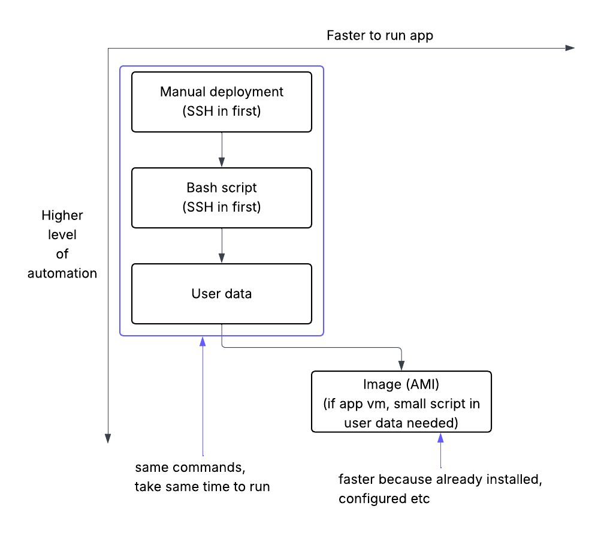

# AMIs

## Levels of automation for app deployment using VMs

An AMI (Amazon Machine Image) is a preconfigured virtual machine image to launch new instances from. They include:
- OS
- software installed
- any other data

of the VM the image was taken from.

The app script has already been run through user data in the original VM and will not be run again -> everything has been installed and configured but the app itself will not be told to start up. 

A small script should be given in user data of the new VM being made from the image including:
- #!/bin/bash
- cd into app folder
- set environment variable for database private IP
- pm2 start app.js