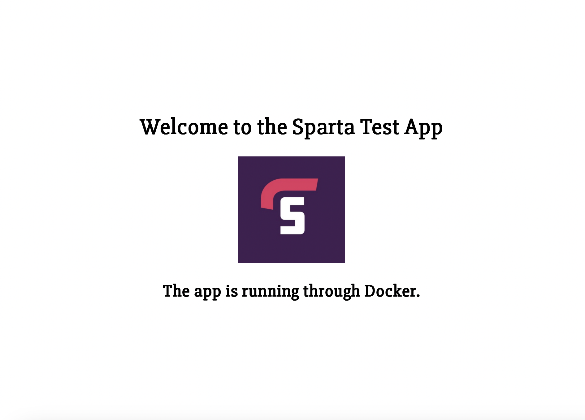
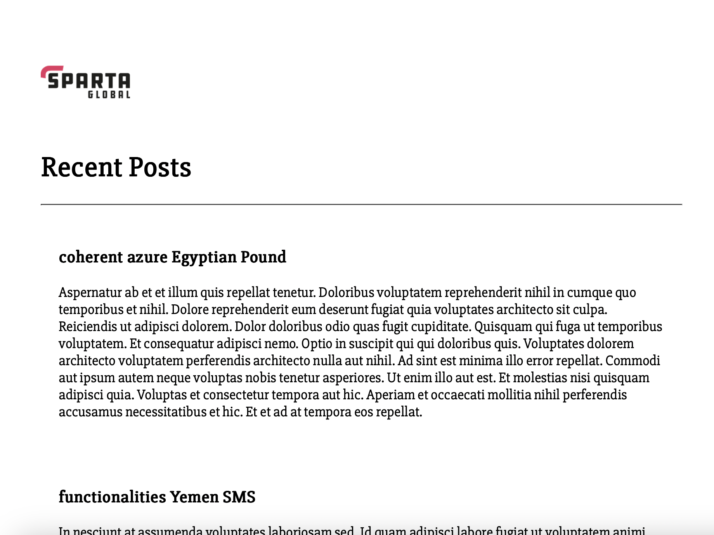

# Docker for Sparta App Deployment

## Day 1
1. Install Docker Desktop
2. Task: Research microservices, containers and Docker
3. Learn to manage Docker containers locally:
    - Task: Run and pull your first image
    - Task: Run nginx web server in a Docker container
    - Task: Remove a container
    - Task: Modify our nginx default page in our running container
    - Task: Run different container on different port
4. Use Docker Hub to host custom images
    - Task: Push host-custom-static-webpage container image to Docker Hub
    - Task: Automate docker image creation using a Dockerfile

### Research
**Microservices**
- a software architecture approach where a single application is built as a collection of small, independent, and loosely couples services, each responsible for a specific business capability
  - *independently deployable*
  - *loosely coupled*
- each service can be separately updated, deployed, and scaled to meet demand for specific functions of an application
- services do not need to share any of their code or implementation with other services
- any communication between individual components happens via well-defined APIs
- benefits:
  - **agility**: small, independent teams work more quickly - shortens development cycle times
  - **flexible scaling**: each service can be independently scaled to meet demand, don't need to scale whole application because one part needs it
  - **easy deployment**: enables CICD, easy to try out new ideas and roll back if necessary. enables experimentation, makes it easier to update code, and accelerates time-to-market of new features
  - **technological freedom**: teams have freedom to choose the best tool to solve specific problems
  - **reusable code**: dividing software into small, well-defined modules enables reuse
  - **resilience**: service independence increases resistance to failure

**Containers**
- standardised software packages that bundle applications with all their necessary dependencies, libraries and config files, ensuring it runs consistenly across different computing environments
- lightweight, standalone, executable packages of software
- makes it easier to maintain consistent behaviour and functionality when moving the contained application between environments (dev, test, prod) and across public, private, hybris cloud and on-prem

**Docker**
- platform as a service (PaaS)
- uses OS level virtualisation to deliver software in containers
- a tool used to automate the deployment of applications in lightweight containers so that they can work efficiently in differeent environments in isolation
- similar to how a virtual machine virtualises server hardware, Docker containers virtualise the operating system of a server


### Docker containers locally

**Run and pull your first image**

Note: using Docker tutorial not Sparta App for first one
- images are used to run containers
- git clone sample application
  - `git clone https://github.com/docker/welcome-to-docker`
  - `cd welcome-to-docker`
- repo already has a Dockerfile, would need to create this otherwise
- build image
  - `docker build -t welcome-to-docker .`
  - `-t` flags image with name
  - `.` lets Docker know where the Dockerfile is
- after build, go to _Images_ tab
- select image name
- _Run_ -> _Optional settings_
  - input port number (8089?)
  - view container live by clicking link under name

**Run nginx web server in a Docker container**

Docker has an official nginx Image that can be used
- search nginx in Docker to find official image
- `docker pull nginx:stable-alpine3.21-perl` or possibly just `docker pull nginx` to download
- `docker run --name my-nginx -p 8080:80 -d nginx` to run default nginx page
- should be running on http://localhost:8080

**Remove a container**

- `docker ps` to see running containers
- `docker ps -a` to see container IDs
- if still running:
  - `docker stop <container name or ID>`
- to remove: `docker rm <container name or ID>`

**Modify nginx default page in container**

- in standard linux shell, by default nginx looks at `/usr/share/nginx/html` for files to serve
- make sure container is running
- `cd /usr/share/nginx/html`
- `nano index.html` and change something
- reload `nginx -s reload`

or with official Docker image:
- `docker exec -it my-nginx sh -c 'echo "<h1>Hello from Docker!</h1>" > /usr/share/nginx/html/index.html'`
  

**Run different container on different port**

- nginx listens on port 80 inside the container
- on the host, any available port can be mapped to the container’s port 80
- `docker run --name <container name> -p <host port>:80 -d <image name>`
  - e.g. `docker run --name my-nginx -p 8081:80 -d nginx`


### Docker Hub to host custom images
**Push host-custom-static-webpage container image to Docker Hub**
- make sure you have a Docker Hub account at https://hub.docker.com
- login from terminal: `docker login`
- tag the local image for Docker Hub
  - needs the format `<dockerhub username>/<repository name>:<tag>`
  - e.g. `docker tag host-custom-static-webpage tjmad43/host-custom-static-webpage:latest`
    - where the first `host-custom-static-webpage` is the local image name
- push to Docker Hub
  - `docker push tjmad43/host-custom-static-webpage:latest`

**Automate docker image creation using a Dockerfile**

instead of running a container, editing i, and committing changes, you can define everything in a Dockerfile to rebuild the image consistently
- e.g. with the nginx image
  - create a project structure with filename (e.g. folder called my-static-site/) containing a Dockerfile and an index.html that you want to display
  - in the Dockerfile:
    - `FROM nginx`
    - `COPY ./index.html /usr/share/nginx/html/index.html`
    - to use the official Nginx image as the base
    - and replace the default index.html with yours
  - build from inside the project folder
    - `docker build -t my-static-site:latest .`
  - run the container
    - `docker run --name my-site -p 8080:80 -d my-static-site:latest`
- to push to Docker Hub:
  - `docker tag my-static-site:latest tjmad43/my-static-site:latest`
  - `docker push tjmad43/my-static-site:latest`
- anytime you want to rebuild:
  - `docker build -t tjmad43/my-static-site:latest .`
  - `docker push tjmad43/my-static-site:latest`
- and anyone else can run it with: 
  - `docker run -p 8080:80 tjmad43/my-static-site:latest`


## Day 2
1. Task: Run Sparta test app in a container
2. Task: Research Docker Compose
3. Task: Use Docker Compose to run app and database containers
**Project Components**
- Dockerfile to build your application image
- Docker application image built and ready for deployment
- Docker Compose YAML file
- Integration with cloud services (if time)
- GitHub repo containing everything needed for the above, and a README file with
  - A structure in the form of completed tasks
  - Each task completed, including:
    - How and why you completed each task
    - Extra explanations
    - Blockers - what was the issue, why, solution
  - What you learnt
  - Benefits you saw personally from the project

### Run Sparta test app in a container
- see Dockerfile in tech508-docker
- from inside tech508-docker:
  - `docker build -t tech508-docker .`
  - `docker run -p 3000:3000 tech508-docker`
  - should be running at http://localhost:3000
  
  - `docker tag tech508-docker tjmad43/tech508-docker:latest`
  - `docker push tjmad43/tech508-docker:latest`
  - to re-run from Docker Hub:
    - `docker pull tjmad43/tech508-docker:latest`
    - `docker run -d -p 3000:3000 tjmad43/tech508-docker:latest` (-d to run in background)
  - to make changes:
    - rebuild: `docker build --no-cache -t tjmad43/tech508-docker:latest .`
    - push: `docker push tjmad43/tech508-docker:latest`
    - stop current image:
      - `docker ps`
      - `docker stop <ID>`
      - `docker rm <ID>`
    - re-run: 
      - `docker pull tjmad43/tech508-docker:latest`
      - `docker run -d -p 3000:3000 tjmad43/tech508-docker:latest`
      


### Docker Compose Research
**Why use it?**
- Docker Compose is a tool for defining and running multi-container applications
- streamlines development, deployment and management of containerised applications
- **Simplified control**: define and manage multi-container apps in one YAML file
- **Efficient collaboration**: shareable YAML files support smooth collaboration between developers and operations, inproving workflows and issue resolution
- **Rapid application development**: Compose caches the confguration used to create a container. Re-using these containers means you can make changes to your environment quickly
- **Portability across environments**: Compose supports variables in the Compose file. You can use these variables to customise your composition for different environments or users

**How to use it**
- Docker Compose can be installed as a standalone, or more conveniently it is installed along with Docker Desktop
  - check installed with `docker compose version`
- the Docker Compose file is usually named `docker-compose.yml` and is stored in the root folder of a project, side by side with the Dockerfile
- Managing an application:
  - start the application in detached mode
    - `docker compose up`
  - start the application in detached mode
    - `docker compose up -d`
    - this runs the app in the background and frees up terminal
  - stop and remove the application
    - `docker compose down`
- check services running:
  - `docker compose ps`
- view logs in real-time:
  - `docker compose logs -f`
  - `-f` streams logs as they happen (follow)
- view docker compose images:
  - `docker compose images`
  - lists images used by services in your Compose file, their tags and sizes

### Use Docker Compose to run app and database containers
- see docker-compose.yaml
- `docker compose up -d`
- `docker exec -it tech508-app sh` to ssh in
- `export DB_HOST="mongodb://mongo:27017/mydatabase"`
- `node seeds/seed.js`
- `npm start &`
- app with db is running at http://localhost:3000/posts
  

### Run on EC2 instance
- Security group:
  - allow ssh, http, port 3000
  - 27017 not needed since traffic goes internally through Docker
  - (why changing the bindIP is not necessary - don't need to connect to db from outside at all)
- User data:
  - update & upgrade
  - install docker
  - & docker compose just in case
  - start docker and add ec2 user as to docker group so it can run commands without sudo
  - ```bash
    sudo DEBIAN_FRONTEND=noninteractive apt update
    sudo DEBIAN_FRONTEND=noninteractive apt upgrade -y
    
    sudo DEBIAN_FRONTEND=noninteractive apt-get install docker -y

    sudo curl -L "https://github.com/docker/compose/releases/download/1.29.2/docker-compose-$(uname -s)-$(uname -m)" -o /usr/local/bin/docker-compose
    sudo chmod +x /usr/local/bin/docker-compose

    sudo service docker start
    sudo usermod -aG docker ec2-user
  ```
- then, same steps as previous section
- app running at `http://<EC2 public IP>:3000` now