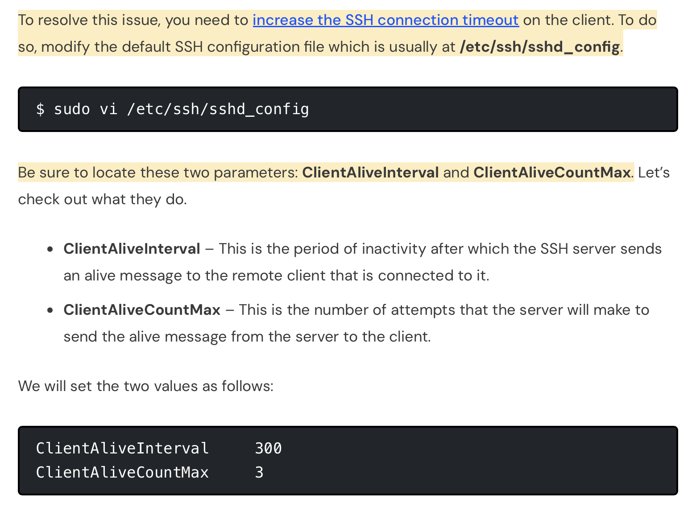

# Linux

## Why learn Linux?
- open-source
- many different distributions (flavours)
- fast-growing
- inexpensive
- stable (compared to Windows)
- scales well
- also can be used as a desktop/workstation for everyday use
- often used to deploy applications
- more employable with Linux experience

## What is Linux?
- spinoff of Unix
- made up of a kernel (core OS) plus many libraries and utilities/tools that rely on it
  
## What is Bash?
- type of shell
  - shell is software/interface that runs commands (AKA a command line interpreter)
- stands for Bourne Again Shell
- range of shells, the most common default is Bash
  - /bin/bash
  - first / refers to top of directory, like C:/ in Windows
  

## Commands

- history of commands: `history`
  - `history -c ` to clear
  - `!number` of command to run that command 
- list files: `ls` 
  - including hidden files: `ls -a` 
  - long format, more file info: `ls -la` 
- download file: `curl URL` `--output filename.extension` to give it a place to go
  - `wget URL -O filename.extension` also works

- rename file: `mv filename newfilename`
- copy file: `cp filename copyfilename`
- delete file: `rm filename`
- make folder: `mkdir foldername`
  - if you use space between words in the folder name, it will create separate folders for them - acceptss multiple arguments
- remove empty directory: `rm -d foldername`
- remove directory: `rm -r foldername`
- help: `[command] --help` or `man [command]`
- make empty file: `touch filename`
- view file info: `cat filename`
- edit file: `nano filename`
- to read a given amount of lines from start of file: `head -[number] filename`
- from bottom of file: `tail -[number] filename`
- to see line numbers: `nl filename`
- search for word in a file: `cat filename | grep word`
  - `|` takes output of first command and feeds into next
- to exit vm: `exit`
- note: use control not command
- note: Linux is case sensitive

## Timeout issue

error: `client_loop: send disconnect: Broken pipe`

Disconnection message that notifies that your SSH connection timeout has been exceeded.
- seems to be an issue sometimes when ServerAliveInterval or ClientAliveInterval set to 0 in ssh config files 

To fix: increse SSH connection timeout

-  ([link]([https://](https://www.tecmint.com/client_loop-send-disconnect-broken-pipe/#:~:text=periods%20of%20time.-,Fix%20Client_loop%3A%20send%20disconnect%3A%20Broken%20pipe%20Error,%2Fetc%2Fssh%2Fsshd_config.&text=Be%20sure%20to%20locate%20these%20two%20parameters%3A%20ClientAliveInterval%20and%20ClientAliveCountMax.)))
- BUT permission to write sshd_config denied
- instead try adding `ServerAliveInterval=600` from client side when connecting (600 is 10 mins)
- which looks like: `ssh -i "tech508-tabitha-aws.pem" -o ServerAliveInterval=600 ubuntu@ec2-54-170-117-111.eu-west-1.compute.amazonaws.com`
- didn't work :/ connection still timed out in less than 10 mins
- may be a problem with public key? see https://unix.stackexchange.com/questions/602518/ssh-connection-client-loop-send-disconnect-broken-pipe-or-connection-reset

